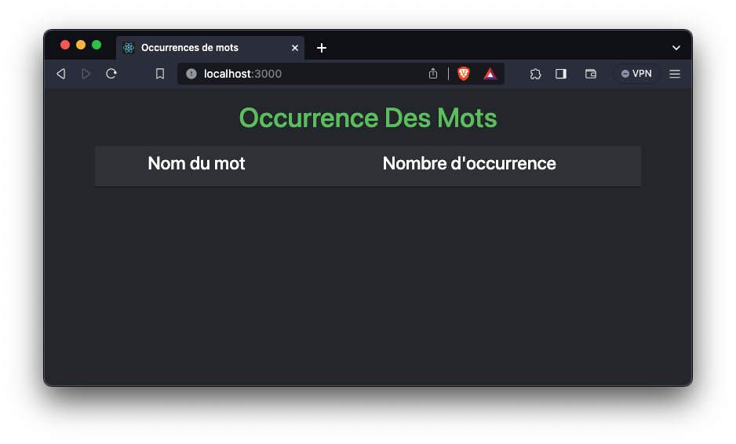
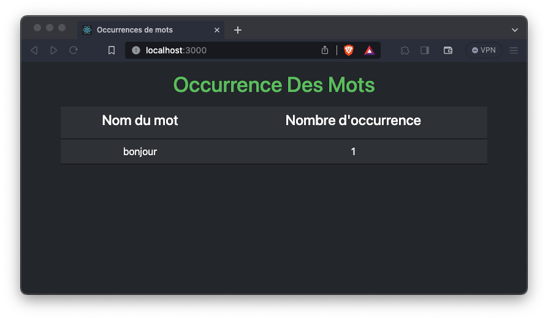

# Serveur React/Redis : Occurrence Des Mots

- Le serveur Redis reçoit des incréments de mots contenus dans des phrases. Il est configuré en notification Pub/Sub sur les clés.
- En BackEnd, le serveur NodeJS a souscrit aux notifications Redis. Il crée un serveur SocketIO pour prévenir le FrontEnd de chaque nouvelle modification, pour mettre a jour la page. Les envois sont en Json pour publier le mot et son nombre d'occurence.
- En FrontEnd, le serveur React est client SocketIO. À chaque nouvelle transmission, le mot et son occurrence remplace l'ancien enregistrement et effectue un tri pour obtenir un affichage des occurences classés.

## Pour Configurer Node
Dans le fichier node/src/config.js
- `redisOptions` : contient l'URL du serveur Redis. Son nom fqdn correspond au nom du conteneur. Le password est à modifier pour l'usage non-dev. Il est injecté dans le conteneur `myredis` au niveau du docker-compose.
- `allNotification` : correspond au pattern de diffusion Redis
- `httpOptions` : permet l'acceptation des requêtes CORS de tout horizon. **Ne pas laisser '*' en prod...**
- `canalSocket` : nom du chanel SocketIO pour communiquer avec React

## Pour Configurer React
Dans le fichier front-occur/src/config.js
- `endPoint` : contient l'URL du serveur NodeJS avec le numéro de port du server SocketIO
- `canalSocket` : nom du chanel SocketIO pour communiquer avec NodeJS

## Pour démarrer
Après avoir récupéré l'ensemble du projet avec un git clone, dans le fichier docker-compose.yml depuis votre IDE, vous pouvez lancer le service. Ou bien, dans un shell la commande suivante :
```shell
docker-compose up -d
```

## Pour tester
Si ce projet est en "standalone" et n'est pas relié à un autre système, vous pouvez tout de même lancer votre navigateur à l'adresse :
```
http://localhost:3000/
```
Une page similaire devrait s'afficher :


Ensuite, en entrant dans le conteneur `myredis`, par exemple avec la commande `docker exec -it myredis /bin/sh`. Vous devez : 
1. Lancer `redis-cli` 
2. Spécifier le mot de passe configuré avec la commande auth. Par exemple `auth redispwd`
3. Augmenter des occurrences de mots autant de fois que vous le souhaitez. Par exemple `INCR bonjour`

L'affichage doit se mettre à jour à chaque incrémentation :

